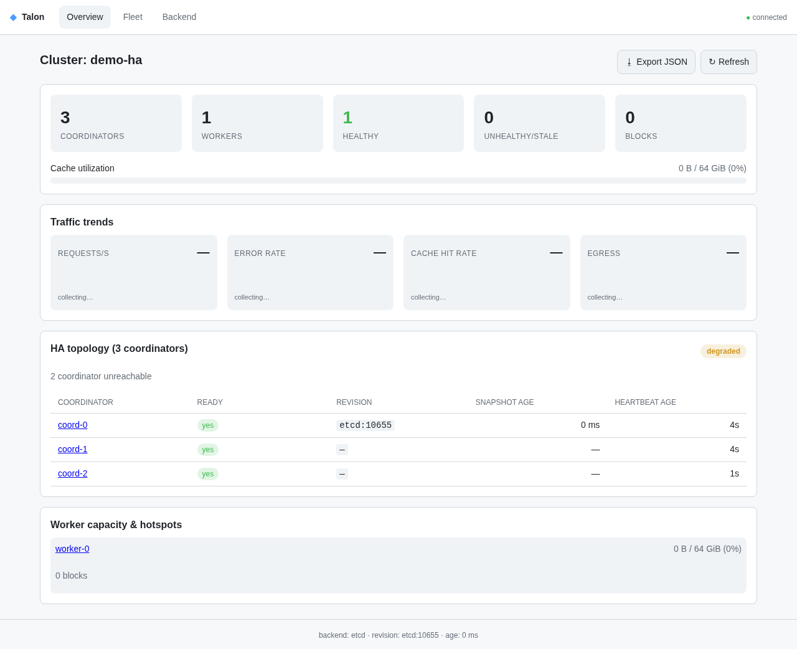

# Talon

**A distributed object-store cache written in Rust.**

Talon sits between compute clients and a durable blob store (S3, GCS, Azure
Blob), caching large immutable objects on local NVMe across a fleet of worker
nodes and serving them through a read-only FUSE filesystem — high sequential
read throughput, horizontal cache scale-out, and POSIX access for unmodified
applications.

[](https://github.com/milvus-io/talon/actions/workflows/ci.yml)
[](LICENSE)

## Quick start

The fastest way to run Talon is with Docker — one command starts a coordinator,
a worker, and the management UI:

```sh
docker compose up
```

Then open the management console at **http://127.0.0.1:8000/ui**, or check health:

```sh
curl -s http://127.0.0.1:8000/readyz           # {"ready":true}
curl -s http://127.0.0.1:8000/api/v1/cluster    # cluster summary JSON
```

This runs a single-node cluster with the development **memory** backend. For the
active-active HA topology (etcd, three coordinators), use `docker compose
--profile ha up`. Full details: [install with Docker](docs/installation/docker.md).

### Kubernetes

For production, deploy with the Helm chart — active-active coordinators, scalable
workers, and a choice of state backend:

```sh
helm install talon deploy/helm/talon -n talon --create-namespace
```

See [install with Kubernetes](docs/installation/kubernetes.md).

### From source

Building from source (Rust toolchain) is the contributor path — see
[installing from source](docs/installation/source.md).

### Management console

Every coordinator serves a built-in web console at **http://127.0.0.1:8000/ui**
— no external assets, no separate deploy. It shows live cluster health, traffic
trends, per-worker capacity and hotspots, an active-active coordinator topology
panel, and a searchable fleet table.



## Documentation

Start with the section that matches what you're doing:

- **Installing Talon** — [Docker](docs/installation/docker.md) (fastest),
  [Kubernetes](docs/installation/kubernetes.md) (production), or
  [from source](docs/installation/source.md) (contributors).
- **Deciding if Talon fits** — [Use cases](docs/use-cases/overview.md): model
  training, checkpointing, notebooks and data sharing, cross-cloud reads, and
  analytics — including where it does *not* help.
- **Reading from Talon in code** — [Client SDKs](docs/clients/overview.md):
  a [Python](docs/clients/python.md) wheel and a native-free
  [Java](docs/clients/java.md) jar, for when a FUSE mount is not the right fit.
- **Using Talon** — the [Getting started tutorial](docs/tutorials/getting-started.md)
  builds the workspace, runs a cluster, and opens the management console;
  [DESIGN.md](DESIGN.md) explains what each component does, and
  [Data-plane runtime](docs/explanation/data-plane-runtime.md) covers the
  zero-copy path and the io_uring measurements.
- **Operating Talon** — [Operator runbook](docs/operations/runbook.md) (HA,
  etcd/Kubernetes backends, configuration, upgrades, alerts) and
  [security hardening](docs/operations/security.md).
- **Understanding Talon** — [DESIGN.md](DESIGN.md) (v1 architecture and the
  decisions behind it) and the [architecture decision records](docs/adr/).
- **Contributing** — [CONTRIBUTING.md](CONTRIBUTING.md) (build, test, submit
  changes) and [BENCHMARKS.md](BENCHMARKS.md) (the microbenchmark harness).

## Contributing

Contributions are welcome — see [CONTRIBUTING.md](CONTRIBUTING.md) to get
started. Run `just` to list common development tasks.

## License

Licensed under the [Apache License, Version 2.0](LICENSE).
