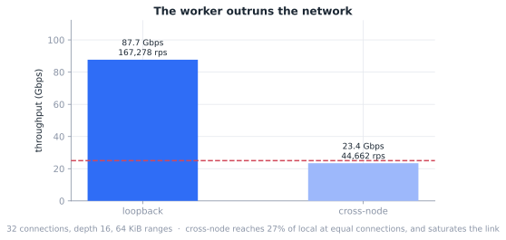
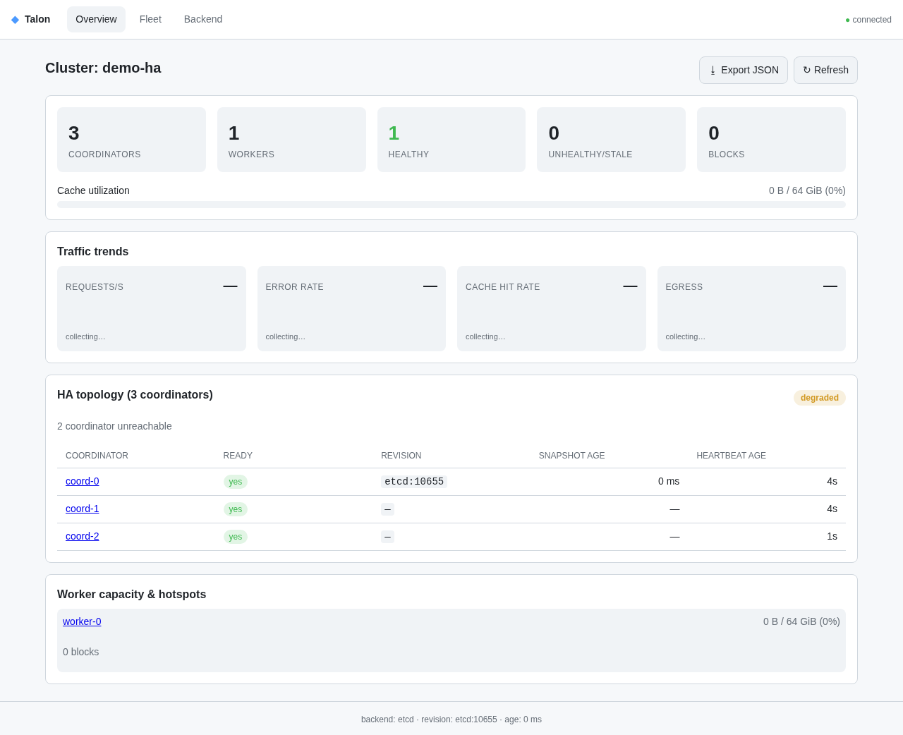

# Talon

[](https://github.com/milvus-io/talon/actions/workflows/ci.yml)
[](LICENSE)

**An object-store cache whose metadata does not grow with your data — so there
is no scaling ceiling and no single point of failure.**

Most caching filesystems put a metadata database in front of your object store,
with a row per file. That database decides how many files you can have, and it
decides what happens when it goes down.

Talon's rule is the opposite: **if a fact can be rebuilt by listing the object
store, it is not stored anywhere.** The namespace, file sizes, mtimes, and
directory structure are all derived from the object store's own key listing.
An ordinary file costs **zero** metadata records. Three things follow:

- **S3 sets your scale limit, not us.** No per-object rows to shard, no inode
  ceiling, no rebalance when the namespace grows.
- **There is little state to protect.** Coordinators are stateless and run
  active-active; restart one and there is nothing to recover. Lose a worker and
  you lose cache, not data — the next read is a miss, not an outage.
- **A plain S3 client can read anything Talon writes.** No proprietary on-disk
  format, no lock-in, no migration to get back out.

Advanced features that genuinely cannot derive their state — hard links, POSIX
locking, write-back — are moving to an **optional**, deliberately sparse
metadata store ([ADR 0003](docs/adr/0003-optional-metadata-store.md), proposed).
Even then the rule holds: a singly-linked, unlocked file still costs zero
records, so the store stays bounded by the features you actually use rather
than by how much data you keep.

Reads never copy: `sendfile` from NVMe to socket, `splice` from socket to NVMe
on fill, driven by io_uring. On an 8-core worker that serves **189K reads/s —
12.4 GB/s** of 64 KiB ranges, at which point **89% of the CPU is kernel time**
and only 11% is Talon's own code. Across a real network the same worker
saturates a **25 GbE link at 23.4 Gbps**, so on a cluster the NIC gives out
before the cache does. Both numbers are published together, because a change
that moves the loopback figure and not the cross-node one has not made anything
faster ([how this is measured](BENCHMARKS.md)).



Read it through a FUSE mount:

```sh
talon-fuse --mountpoint /mnt/talon \
  --coordinator 127.0.0.1:7000 \
  --namespace-prefix s3/training-data

ls /mnt/talon                 # your bucket, as a directory tree
```

or skip the mount and use the [Python](docs/clients/python.md),
[Java](docs/clients/java.md), or [C](docs/clients/c.md) SDKs:

```python
import talon

# block_size must match the workers' configured block size
with talon.Client("coordinator-host:7000", block_size=8 << 20) as client:
    chunk = client.read("s3://training-data/shard-0.parquet",
                        offset=0, length=1 << 20)
```

Prewarm a file's blocks across the workers responsible for them:

```sh
talon-client load --coordinator coordinator-host:7000 \
  --path /s3/training-data/shard-0.parquet --version '<ETag>' --size 1073741824
# Add --block-size <bytes> if workers/readers use a non-default block size.
```

The Rust SDK exposes the same operation as
`client.load(&object, &version, size).await`. The caller must provide the
correct file size for that version.

For multiple files, use `client.batch_load(&[LoadRequest { object, version,
size }, ...]).await` or a JSON manifest:

```json
[
  {"path": "/s3/training-data/shard-0.parquet", "version": "etag-0", "size": 1073741824},
  {"path": "/s3/training-data/shard-1.parquet", "version": "etag-1", "size": 536870912}
]
```

```sh
talon-client batch-load --coordinator coordinator-host:7000 --manifest files.json
```

Batch load groups assignments by worker and sends up to **1024 block load
instructions in one protocol request**, followed by one acknowledgement.
Requests also fit the 1 MiB control-frame limit, including tracing metadata;
long identities can cause earlier splitting. Workers process each batch with up
to eight concurrent block loads. All batches and single LOADs on a worker share
that block limit. On the first observed failure, the worker stops adding work
and drains its existing window, retaining completed cache fills. The SDK
returns per-file counts in input order on success, or an error on any failed
batch. Empty input succeeds without network I/O. Single and batch loads share
the same client and worker RPC admission limits; a batch counts as one active RPC.

The caller's version is the exact source version used by normal version-pinned
reads. Load uses the same Maglev primary placement, and each worker fills only
its assigned blocks using its configured whole-block or paged cache. A small
file may have no blocks assigned to some workers. Repeated loads reuse resident
data. The client sends LOAD directly to workers using its cached membership;
the coordinator only provides ordinary membership discovery. Cached instance
discovery remains usable during a coordinator outage until its advertised
validity expires. Dispatch then requires fresh discovery, just like reads;
offline or conflicting logical owners are not replaced by other workers. LOAD issues no
HEAD: block and page extents come from the supplied size. Normal conditional origin reads still
apply; LOAD does not replace the caller's version with the current version.

Workers automatically retry transient origin failures, including S3 `429` and
`503 SlowDown`, through the same HTTP retry policy used by reads. The default is
three retries after the first attempt, with exponential backoff and full jitter
(100 ms base, 5 s cap); `Retry-After` in seconds is honored up to that cap.
`backend_max_retries`, `backend_retry_base_ms`, and `backend_retry_max_delay_ms`
configure this policy. Backoff retains the block's concurrency permit. Only the
failed origin request is retried; completed blocks are not replayed. Permission
denied, missing objects, and version mismatches (`403`, `404`, `412`) are not
retried. Exhausted retries fail the block and follow the batch failure behavior
above.

The command waits until all assigned blocks finish and returns loaded byte and
block counts. A worker error, timeout, or observed membership change fails the
request; successfully warmed data remains cached and the request can be retried.
Load is best-effort cache warming: entries remain subject to ordinary eviction,
and neither pinned residency nor automatic rebalancing after completion is
promised. Dropping the client operation stops further dispatch; workers may
finish requests they have already accepted. A client and its clones share a
limit of eight active requests, with a two-minute single-block RPC timeout and
a 30-minute batch RPC and overall operation timeout. Each worker also admits at most eight concurrent
LOAD requests and rejects excess requests for the caller to retry later. Load
requires workers implementing `LoadBlock` and `BatchLoad` in control schema 6;
no additional coordinator upgrade is needed.
Existing operations retain their original wire schemas.

**POSIX behaviour is measured, not asserted.** Against a real kernel mount,
Talon passes **99.2% of pjdfstest** (8,731 of 8,798 assertions across 238 test
files). Reproduce it in one command:

```sh
sudo TALON_REQUIRE_FUSE=1 TALON_RUN_PJDFSTEST=1 \
  cargo test -p talon-fuse --features mount --test mount_e2e \
  mount_pjdfstest_compatibility_suite -- --ignored --nocapture
```

The remaining 0.8% is one gap, not sixty-seven: **hard links to object-backed
files are refused with `EPERM`**. A hard link would need a copy per path, and
copies can diverge with nothing to reconcile them ([#363](https://github.com/milvus-io/talon/issues/363)),
so Talon refuses rather than approximating. The fix is inode indirection
([ADR 0003 §5](docs/adr/0003-optional-metadata-store.md)); until it lands, 51 of
those 67 failures are that refusal and its cascade. **POSIX locking is likewise
refused rather than faked** — `getlk`/`setlk` return `EOPNOTSUPP` instead of
falling back to kernel-local locks that would look cluster-wide and not be.

**Status: v0.1, pre-1.0.** The APIs and on-disk layout may still change between
releases. What is claimed above is measured and reproducible; what is not
claimed yet is a stability guarantee.

## Quick start

The fastest way to run Talon is with Docker — one command starts a coordinator,
a worker, and the management UI:

```sh
docker compose up
```

Then open the management console at **http://127.0.0.1:8000/ui**, or check health:

```sh
curl -s http://127.0.0.1:8000/readyz           # {"ready":true}
curl -s http://127.0.0.1:8000/api/v1/cluster    # cluster summary JSON
```

This runs a single-node cluster with the development **memory** backend. For the
active-active HA topology (etcd, three coordinators), use `docker compose
--profile ha up`. Full details: [install with Docker](docs/installation/docker.md).

### Kubernetes

For production, deploy with the Helm chart — active-active coordinators, scalable
workers, and a choice of state backend:

```sh
helm install talon deploy/helm/talon -n talon --create-namespace
```

See [install with Kubernetes](docs/installation/kubernetes.md).

### From source

Building from source (Rust toolchain) is the contributor path — see
[installing from source](docs/installation/source.md).

### Management console

Every coordinator serves a built-in web console at **http://127.0.0.1:8000/ui**
— no external assets, no separate deploy. It shows live cluster health, traffic
trends, per-worker capacity and hotspots, an active-active coordinator topology
panel, and a searchable fleet table.



## Documentation

Start with the section that matches what you're doing:

- **Installing Talon** — [Docker](docs/installation/docker.md) (fastest),
  [Kubernetes](docs/installation/kubernetes.md) (production), or
  [from source](docs/installation/source.md) (contributors).
- **Deciding if Talon fits** — [Use cases](docs/use-cases/overview.md): model
  training, checkpointing, notebooks and data sharing, cross-cloud reads, and
  analytics — including where it does *not* help.
- **Reading from Talon in code** — [Client SDKs](docs/clients/overview.md):
  a [Python](docs/clients/python.md) wheel, a native-free
  [Java](docs/clients/java.md) jar, and async [C](docs/clients/c.md) bindings
  for when a FUSE mount is not the right fit.
- **Using Talon** — the [Getting started tutorial](docs/tutorials/getting-started.md)
  builds the workspace, runs a cluster, and opens the management console;
  [DESIGN.md](DESIGN.md) explains what each component does, and
  [Data-plane runtime](docs/explanation/data-plane-runtime.md) covers the
  zero-copy path, the ring scaling tables, and why io_uring beats Tokio at high
  connection counts (26% more throughput, 17× lower p50 at 1024 connections).
- **Operating Talon** — [Operator runbook](docs/operations/runbook.md) (HA,
  etcd/Kubernetes backends, configuration, upgrades, alerts) and
  [security hardening](docs/operations/security.md).
- **Understanding Talon** — [DESIGN.md](DESIGN.md) (v1 architecture and the
  decisions behind it) and the [architecture decision records](docs/adr/).
- **Contributing** — [CONTRIBUTING.md](CONTRIBUTING.md) (build, test, submit
  changes) and [BENCHMARKS.md](BENCHMARKS.md) (the benchmark harness, the
  measured throughput ceilings, and what was measured and rejected).

## Contributing

Contributions are welcome — see [CONTRIBUTING.md](CONTRIBUTING.md) to get
started. Run `just` to list common development tasks.

## License

Licensed under the [Apache License, Version 2.0](LICENSE).
