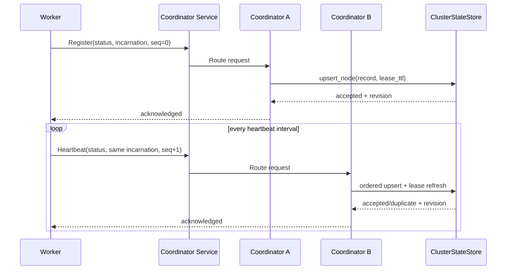
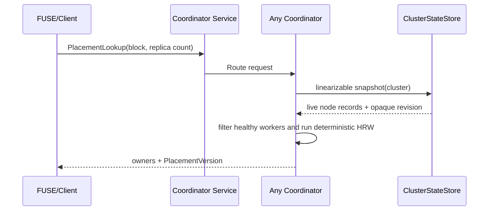
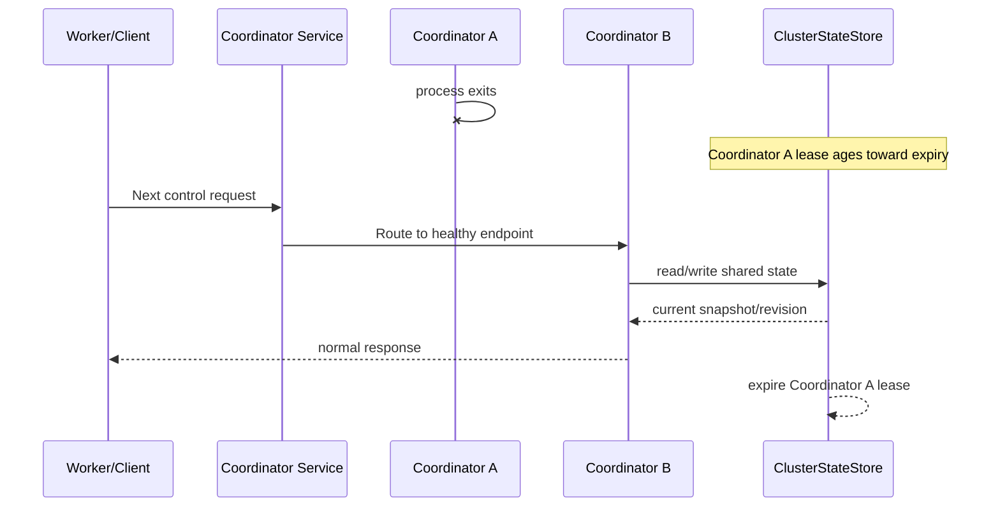

# ADR 0001: Active-Active Management Plane and Shared Cluster State

- Status: Accepted
- Date: 2026-07-23
- Tracking issue: #72
- Decision issue: #73

## Context

Talon v1 has one coordinator. Worker registration, membership, and placement
state are process-local. This is adequate for initial data-path development but
does not satisfy the management-plane requirements tracked by #72:

- operators must see every coordinator and worker, including health, capacity,
  inventory, traffic, and cache behavior;
- every process must expose Prometheus metrics plus liveness and readiness;
- the UI must be served by coordinators;
- coordinators must be horizontally scalable and disposable;
- users must be able to select Kubernetes API or etcd as the strongly
  consistent shared-state backend.

The cache data itself remains on workers and the blob store remains the durable
source. The management work must not turn the coordinator into a durable
metadata owner or route data-plane bytes through it.

## Decision

### 1. Coordinators are active-active

Every coordinator can serve all control and management operations:

- worker registration and heartbeat;
- membership and placement lookup;
- health, readiness, and Prometheus metrics;
- management API and UI.

There is no leader on the request path. Coordinators are placed behind one
load-balanced service address, and a worker or client may reach a different
coordinator on each connection.

A coordinator may keep bounded local caches for latency and resilience, but
those caches are never authoritative. Deleting a coordinator process must not
require state recovery before another coordinator can serve traffic.

Leader election is deliberately excluded. It would add failover delay and a
single active request path without protecting any operation that requires
single-writer ownership. If Talon later gains durable write-back metadata or a
singleton workflow, that feature requires a separate ADR.

### 2. Shared state contains bounded, rebuildable node records

The shared store is authoritative for the current cluster view, but its data is
ephemeral and rebuildable from live processes. It contains one leased record
per coordinator or worker.

Each record contains:

- cluster ID, stable node ID, role, and process-incarnation ID;
- control/data address and administration address;
- build version and process start time;
- heartbeat sequence and server-observed update time;
- health/readiness summary;
- bounded capacity, inventory, and cumulative counter snapshot;
- bounded deployment labels such as region, zone, pod, and host.

The initial wire/store limits are:

- `node_id`, `incarnation_id`, version, and address fields: 256 bytes each;
- at most 16 deployment labels;
- label keys: 63 bytes; label values: 256 bytes;
- serialized status record: 16 KiB;
- cumulative counters: unsigned 64-bit integers;
- durations and timestamps: integer milliseconds unless the field name declares
  another unit.

The health state is one of `healthy`, `degraded`, `unhealthy`, or `unknown`.
Readiness is a separate boolean because a live process can be healthy enough to
report diagnostics while intentionally removed from service.

It does not contain:

- object names, block keys, or per-object metrics;
- cache file indexes or data needed to reconstruct worker storage;
- time-series samples;
- credentials, tokens, certificates, or backend secrets;
- UI sessions or arbitrary user content.

Prometheus remains the time-series system. The shared record only carries the
latest bounded snapshot needed to render a useful cluster view when Prometheus
is absent.

### 3. Node updates are lease-based and ordered

Each process has:

- a stable `node_id` for its deployment identity;
- a random `incarnation_id` created at process start;
- a `heartbeat_seq` that starts at zero and increases for that incarnation.

The store accepts an update when:

1. no record exists;
2. the incarnation differs, meaning the process restarted; or
3. the incarnation matches and the sequence is greater than the stored
   sequence.

Older or duplicate updates are idempotently ignored. This prevents delayed
heartbeats routed through different coordinators from moving status backward.

Default timing:

- heartbeat interval: 5 seconds;
- unhealthy threshold: 15 seconds without an accepted update;
- lease expiry: 30 seconds without an accepted update.

All three values are configurable. Validation requires:

```text
heartbeat_interval < unhealthy_after < lease_ttl
```

An unhealthy record remains visible for diagnosis until lease expiry. An
expired record is excluded from placement and normal node lists.

### 4. `ClusterStateStore` has one backend-neutral contract

The coordinator uses an async interface with these conceptual operations:

```text
upsert_node(record, lease_ttl) -> WriteResult
remove_node(cluster_id, node_id, incarnation_id) -> WriteResult
snapshot(cluster_id, consistency=linearizable) -> ClusterSnapshot
watch(cluster_id, after_revision) -> ordered NodeEvent stream
check_ready() -> BackendHealth
```

`ClusterSnapshot` contains:

- all non-expired node records observed in one consistent list operation;
- an opaque backend revision;
- the server time or observation time needed to calculate heartbeat age.

Revisions are opaque byte/string tokens. Callers may use them for equality,
resume, diagnostics, and cache freshness, but must not parse them as integers
or compare them numerically. Kubernetes resource versions are intentionally
opaque; etcd revisions happen to be numeric but do not change the common
contract.

The watch API may report that a revision was compacted or expired. The caller
must recover by taking a new linearizable snapshot and restarting the watch.

The repository includes a reusable backend contract suite. Every production
backend must pass the same tests for:

- insert, update, duplicate update, and stale update;
- process restart with a new incarnation;
- concurrent writers;
- lease expiry and explicit removal;
- consistent snapshot and revision handling;
- watch resume and compaction recovery;
- authentication, timeout, and backend-unavailable errors.

### 5. etcd mapping

The etcd backend stores each node under a cluster-scoped prefix:

```text
/talon/clusters/<cluster-id>/nodes/<role>/<node-id>
```

The value is the versioned node record. The key is attached to an etcd lease.
Updates use transactions where needed to preserve the incarnation/sequence
rule. Snapshot reads are linearizable and return the etcd response revision.
Watches resume from the last observed revision and recover from compaction by
listing again.

The backend supports endpoint lists, authentication, TLS, request timeouts, and
prefix configuration. Talon does not embed or operate etcd.

### 6. Kubernetes mapping

The Kubernetes backend uses one namespaced `coordination.k8s.io/v1` `Lease` per
Talon process. Labels identify the Talon cluster, role, and node. Lease fields
are the liveness authority; bounded versioned status is stored in a Talon-owned
annotation on the same object unless implementation limits require a later,
explicitly reviewed secondary object.

Updates use Kubernetes optimistic concurrency through `metadata.resourceVersion`
and retry bounded conflicts. Lists are requested with Kubernetes API semantics
that provide a consistent current snapshot and return a resource version.
Watches start from that resource version. Expired/too-old watch versions cause
a relist.

The default RBAC is namespace-scoped and grants only the verbs required to
get, list, watch, create, update, patch, and delete Talon Lease objects selected
by the deployment's naming and label conventions.

Talon does not introduce a custom resource definition or require an operator
for this feature.

### 7. Placement uses an opaque membership version

The current wall-clock-seeded numeric epoch is process-specific. It cannot be
the cross-coordinator source of truth.

Placement responses will carry an opaque `PlacementVersion` derived
deterministically from the canonical placement-relevant worker set:

- healthy worker IDs;
- worker data-plane addresses;
- any future placement weight or failure-domain field.

The canonical list is sorted before hashing/version construction. Two
coordinators reading the same snapshot therefore return the same placement
owners and version.

Clients treat the version as an equality token:

- equal means the cached decision was built from the same membership;
- different means invalidate and refresh.

Clients must not assume a version is numerically greater or lower. Connect
failure, wrong owner, not found, and TTL expiry remain independent refresh
triggers.

**Wire representation (delivered by #80).** The version stays the existing
`u64` field on `PlacementResponse`/`EpochBump`, so the transition is
wire-compatible — no new message or schema bump is required. What changes is how
the value is *produced* and *interpreted*: the coordinator now fills it with a
64-bit xxh3 hash of the canonical, id-sorted worker set (each node's id,
address, and role, length-delimited), and clients compare it for equality rather
than magnitude. An all-zero value is reserved for the empty node set.

**Rolling upgrade.** During a mixed-version window some coordinators emit the
old wall-clock-seeded epoch and some emit the new hash. A client that caches a
placement from one and then observes a different value from the other simply
invalidates and refreshes — the worst case is an extra lookup, never a stale
pin, because the new equality rule treats *any* difference as a refresh trigger
(the old "strictly greater" rule was the only thing that could ignore a peer's
value). Once all coordinators run the new code, two of them observing the same
membership emit the identical token and the spurious refreshes stop. No operator
action or flag day is required.

### 8. Backend failure is fail-closed for new authoritative reads

If a coordinator cannot obtain a snapshot within its configured timeout:

- readiness becomes false;
- registration and heartbeat return an explicit retryable failure;
- new membership and placement lookups fail instead of claiming stale state is
  current;
- the management API returns `503 Service Unavailable`;
- the UI may retain the last successful response locally but must mark it stale
  with its observation time.

Existing clients may continue using their short-lived placement cache and
normal replica fallback. A coordinator-local last-good snapshot may be exposed
for diagnostics but is not used as an unmarked authoritative response.

Liveness remains true while the process can run its event loop and serve the
liveness endpoint. This distinction lets an orchestrator remove an unready
coordinator from service without restarting every process during a shared-store
incident.

### 9. Management HTTP surface is separated from the data path

Each process has a configurable administration listener.

Workers expose:

- `GET /healthz`;
- `GET /readyz`;
- `GET /metrics`;
- `GET /api/v1/status`.

Coordinators expose:

- `GET /healthz`;
- `GET /readyz`;
- `GET /metrics`;
- read-only `/api/v1` cluster and node resources;
- the embedded management UI and its static assets.

The management API reads the same `ClusterStateStore` snapshot used by the
control path. It does not scrape workers on demand and does not proxy arbitrary
Prometheus queries.

API responses include schema version, generation time, snapshot revision, and
explicit units. Lists have stable ordering, filtering, and bounded pagination.

### 10. Metrics have bounded cardinality

Process metrics follow Prometheus naming and label guidance:

- base units use seconds and bytes;
- cumulative values use `_total`;
- one metric name represents one unit and one logical quantity;
- labels are limited to bounded dimensions such as operation, role, backend,
  outcome, and block form.

Object path, block ID, request ID, error text, peer address, and unbounded node
labels are forbidden as Prometheus labels. Prometheus target metadata identifies
the process instance; worker-local metrics do not add a redundant worker-ID
label to every series.

High-cardinality diagnostic values belong in tracing/log fields, not metric
labels.

The minimum process metric inventory is:

| Process | Required metric groups |
| --- | --- |
| All | build info, uptime, accepted requests, errors, request duration, active connections, readiness |
| Worker | hit/miss, bytes served, backend fetch duration/errors, in-flight loads, blocks/pages, resident bytes, capacity, evictions, heartbeat outcomes |
| Coordinator | registration/heartbeat outcomes, state-store operation duration/errors, snapshot age, live nodes by role/health, placement duration/errors |

The bounded status record carries the latest cumulative totals and gauges needed
for the built-in UI: requests, errors, hit/miss, bytes served, backend errors,
in-flight loads, blocks/pages, resident bytes, capacity, evictions, and
placement/store health where applicable. Histograms remain Prometheus-only.

### 11. Security boundary

Health, metrics, API, and UI exposure are configurable independently.

Production deployments must support either:

- direct TLS and authentication on the administration listener; or
- binding to a trusted internal interface behind an authenticated TLS reverse
  proxy.

Authentication fails closed when enabled. Proxy identity headers are accepted
only from configured trusted proxies. Secrets are redacted from configuration
debug output, logs, metrics, status records, and API errors.

The UI has no direct credentials for etcd, Kubernetes, workers, or Prometheus.
It talks only to the same-origin coordinator API.

## Request flows

### Worker registration and heartbeat



### Placement lookup



### Coordinator failure



## Configuration

The existing precedence remains:

```text
CLI > environment > config file > defaults
```

Common coordinator settings include:

- cluster ID and node ID;
- control and administration listen/advertise addresses;
- state backend: `memory`, `etcd`, or `kubernetes`;
- heartbeat interval, unhealthy threshold, lease TTL, and request timeout;
- authentication/TLS or trusted-proxy settings.

`memory` is valid only for development, unit tests, and explicit
single-coordinator mode. Configuration validation rejects `memory` when HA is
enabled or the requested coordinator replica count is greater than one.

Backend-specific credentials are read from environment variables or mounted
files and are never serialized into status structures.

## Compatibility and rollout

Protocol and API versions change independently.

- The binary control envelope rejects unsupported schema versions before
  decoding message fields.
- The node-status message transition must define mixed-version behavior and
  tests in #74.
- Management JSON is namespaced under `/api/v1`; additive fields are allowed,
  while incompatible changes require `/api/v2`.
- Placement-version rollout must prevent old clients from interpreting opaque
  versions as ordered counters; #80 owns the transition.
- Backend record values include their own schema version so rolling
  coordinators can reject or safely ignore unsupported records.

## Consequences

### Positive

- Any coordinator can serve traffic, so there is no leader failover delay.
- Process replacement does not require coordinator state recovery.
- Kubernetes-native users do not need a separately operated etcd deployment.
- Non-Kubernetes users can use etcd with equivalent Talon semantics.
- The UI and control path share one coherent cluster snapshot.
- Prometheus retains its proper role as the time-series system.

### Costs and risks

- The control path now depends on shared-store availability.
- Kubernetes heartbeat writes add API-server load and require bounded payloads
  and measured intervals.
- Both production backends require real integration and failure tests.
- Opaque placement versions require a protocol/client cache transition.
- Active-active correctness depends on ordered heartbeat updates and strict
  backend contract tests.

## Rejected alternatives

### Leader/standby coordinators

Rejected because current operations do not require one writer. It would leave
most replicas idle and add election/failover behavior without removing the
shared-state dependency.

### Coordinator-local state with best-effort replication

Rejected because coordinators could return different membership and placement
after failover or partition.

### Prometheus as the cluster-state source

Rejected because scrape data is delayed, pull-based, and not a lease or
linearizable coordination system.

### Store all time-series metrics in Kubernetes or etcd

Rejected because it creates high write amplification and turns a coordination
store into a monitoring database.

### Custom Raft inside Talon

Rejected because Kubernetes API and etcd already provide the required strongly
consistent substrate. Talon has no durable metadata that justifies operating
another consensus system.

### Kubernetes custom resource and operator

Rejected for the first implementation. Native Lease objects and conventional
deployment/RBAC are sufficient for ephemeral node liveness and bounded status.

## Delivery map

Each item is one issue and one PR:

1. #74 - shared status model and control-protocol versioning.
2. #75 - store abstraction, error model, and memory contract backend.
3. #76 and #77 - worker and coordinator process observability.
4. #78 and #79 - etcd and Kubernetes production backends.
5. #80 - deterministic placement-version transition.
6. #81 - active-active coordinator runtime.
7. #82 - management REST API.
8. #83 and #84 - embedded UI foundation and operator workflows.
9. #85 - authentication, TLS, and HTTP hardening.
10. #86, #87, #89, and #90 - deployment, dashboards, HA tests, and runbooks.

## References

- Kubernetes Leases:
  https://kubernetes.io/docs/concepts/architecture/leases/
- Kubernetes API resource versions:
  https://kubernetes.io/docs/reference/using-api/api-concepts/#resource-versions
- etcd API guarantees:
  https://etcd.io/docs/v3.6/learning/api_guarantees/
- etcd lease API:
  https://etcd.io/docs/v3.6/dev-guide/api_reference_v3/#service-lease
- Prometheus metric and label naming:
  https://prometheus.io/docs/practices/naming/
