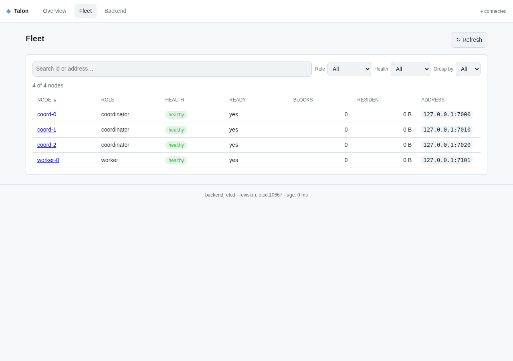
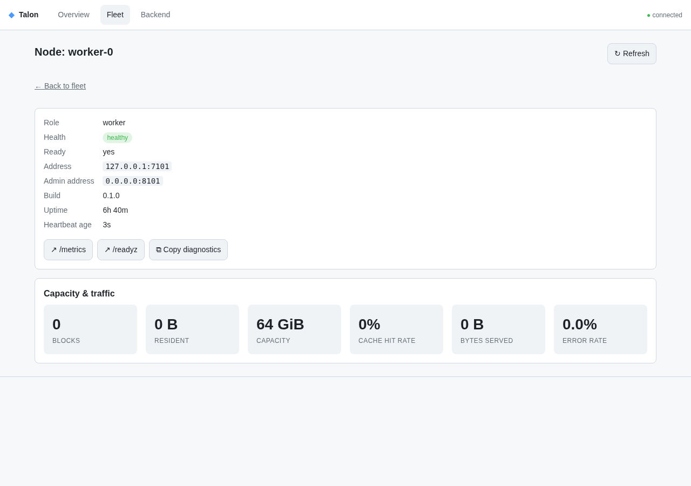

# Getting started

This tutorial takes you from a fresh checkout to a running Talon cluster that
you can inspect through its management API and web console. It uses the
development **memory** backend, so it needs no external etcd, Kubernetes, or
object store.

By the end you will have:

- built the workspace,
- started a coordinator and a worker that register into one cluster,
- confirmed the cluster is healthy through the API and the UI,
- and set up the FUSE client, ready to mount.

Every command below has been run as written. Where a step needs something this
tutorial deliberately doesn't set up (a real object store, kernel FUSE), that is
called out explicitly rather than glossed over.

## Prerequisites

- **Rust** — the toolchain is pinned in `rust-toolchain.toml`; `rustup` selects
  it automatically. No manual version juggling.
- **A Linux host** — required for the FUSE client (the final section). The
  coordinator and worker themselves run anywhere Rust does.
- **`curl`** — to poke the API in this tutorial (any HTTP client works).

## 1. Build

```sh
git clone https://github.com/milvus-io/talon.git
cd talon
cargo build --workspace
```

The first build compiles all crates and may take a few minutes; later builds are
incremental.

## 2. Start a coordinator

The coordinator tracks cluster membership and serves the management API and UI.
Run it with the default **memory** backend — single process, no shared state,
intended for development:

```sh
cargo run -p talon-coordinator -- \
  --listen 127.0.0.1:7000 \
  --admin-listen 127.0.0.1:8000 \
  --cluster-id demo \
  --node-id coord-0
```

- `--listen` is the control plane workers and clients connect to.
- `--admin-listen` serves health, metrics, the management API, and the UI.

Leave it running. You'll see it log `coordinator serving control plane`.

> The memory backend is development-only. It refuses to start in HA mode
> (`ha_enabled` or `coordinator_replicas > 1`). For active-active coordinators
> backed by etcd or Kubernetes, see the [operator runbook](../operations/runbook.md).

## 3. Start a worker

The worker stores cached object data and registers with the coordinator. It
requires an object-store backend to be *configured* at startup, even though this
tutorial won't fetch real objects — so we provide placeholder Azure credentials
and a local cache directory. The backend is only contacted when data is actually
read.

In a second shell:

```sh
mkdir -p /tmp/talon-cache

TALON_WORKER_AZURE_ACCOUNT=demo \
TALON_WORKER_AZURE_SAS="sv=demo&sig=demo" \
TALON_WORKER_CACHE_DIRS=/tmp/talon-cache \
cargo run -p talon-worker -- \
  --listen 127.0.0.1:7001 \
  --admin-listen 127.0.0.1:8001 \
  --coordinator 127.0.0.1:7000 \
  --cluster-id demo \
  --node-id worker-0
```

The worker logs `registered with coordinator`. Over on the coordinator you'll
see `worker registered id=worker-0`.

> **Placeholder credentials** are fine for exploring the control plane, the API,
> and the UI. To read real objects you need genuine credentials for your blob
> store; keep secrets out of shell history and config files (see
> [security.md](../operations/security.md)). The Azure SAS token is read only
> from `TALON_WORKER_AZURE_SAS`, never from a config file.

## 4. Confirm the cluster is healthy

Ask the coordinator's admin API whether it's ready and what it sees:

```sh
curl -s http://127.0.0.1:8000/readyz
# {"ready":true}

curl -s http://127.0.0.1:8000/api/v1/cluster
```

The cluster summary reports one coordinator and one healthy worker:

```json
{
  "cluster_id": "demo",
  "node_count": 2,
  "coordinator_count": 1,
  "worker_count": 1,
  "healthy_worker_count": 1,
  ...
}
```

List the individual nodes, or inspect one:

```sh
curl -s "http://127.0.0.1:8000/api/v1/nodes"
curl -s "http://127.0.0.1:8000/api/v1/nodes/worker-0"
```

Each process also exposes Prometheus metrics at `/metrics` and a liveness probe
at `/healthz` on its admin port (`:8000` for the coordinator, `:8001` for the
worker).

## 5. Open the management console

The coordinator serves a web UI from its admin port:

```
http://127.0.0.1:8000/ui
```

The **overview** shows the cluster summary, live traffic trends, an HA topology
panel (more interesting once you run multiple coordinators), per-worker capacity
and hotspots, and cache utilization. The worker you started appears as `healthy`
and refreshes on its heartbeat.


The **Fleet** view is a dense, sortable, and filterable table of every node —
search by id or address, filter by role or health, and group by any label:



Click any node for its **detail** view: identity, uptime, heartbeat age, and —
for workers — capacity and traffic, plus direct links to that node's `/metrics`
and `/readyz` and a one-click diagnostics copy:



> The screenshots above show a three-coordinator HA cluster (the HA topology
> panel lists all three); your single-node tutorial cluster shows one
> coordinator and one worker.

## 6. Set up the FUSE client

The `talon-fuse` client exposes cached objects as a read-only POSIX filesystem.
Mounting talks to the kernel, so it is compiled behind a `mount` feature and
requires `/dev/fuse` (Linux with FUSE available).

Build and run it against your coordinator:

```sh
mkdir -p /tmp/talon-mnt

cargo run -p talon-fuse --features mount -- \
  --mountpoint /tmp/talon-mnt \
  --coordinator 127.0.0.1:7000
```

Built **without** `--features mount`, the client still performs all of its setup
and validation, then prints a message instead of mounting — useful on hosts
without `/dev/fuse`:

```
built without the `mount` feature: not mounting.
Rebuild with `--features mount` to enable the kernel FUSE mount.
```

> **Reading real objects** requires a worker configured against a real object
> store (Section 3 used placeholders) and the coordinator's object-listing path.
> Populating the namespace and serving object reads end-to-end is beyond this
> introductory tutorial — see [DESIGN.md](../../DESIGN.md) for the read path and
> the [operator runbook](../operations/runbook.md) for production configuration.

## Clean up

Stop the FUSE client, worker, and coordinator with `Ctrl-C` in each shell. The
FUSE client unmounts cleanly on `SIGINT`. Remove the scratch directories if you
like:

```sh
rm -rf /tmp/talon-cache /tmp/talon-mnt
```

## What next

- **Run it in production** — active-active coordinators, etcd/Kubernetes
  backends, deployment manifests, upgrades, and alerts:
  [operator runbook](../operations/runbook.md).
- **Secure it** — authentication, TLS, and HTTP hardening:
  [security.md](../operations/security.md).
- **Understand it** — the v1 architecture and the decisions behind it:
  [DESIGN.md](../../DESIGN.md) and the [ADRs](../adr/).
- **Contribute** — build, test, and submit changes:
  [CONTRIBUTING.md](../../CONTRIBUTING.md).
